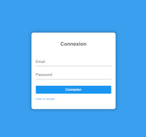

# Component Login

Ce component vous permet d'avoir une base de login de connexion.



Si vous avez une bordure blanche tout autour il vous suffit de mettrer dans votre page principale ex: /page/index.vue : 
<br><br>

```html
<style>
  body {
    margin:0;
  }
</style>
```


